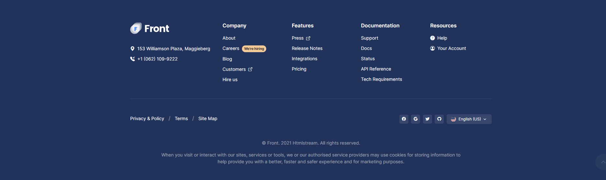
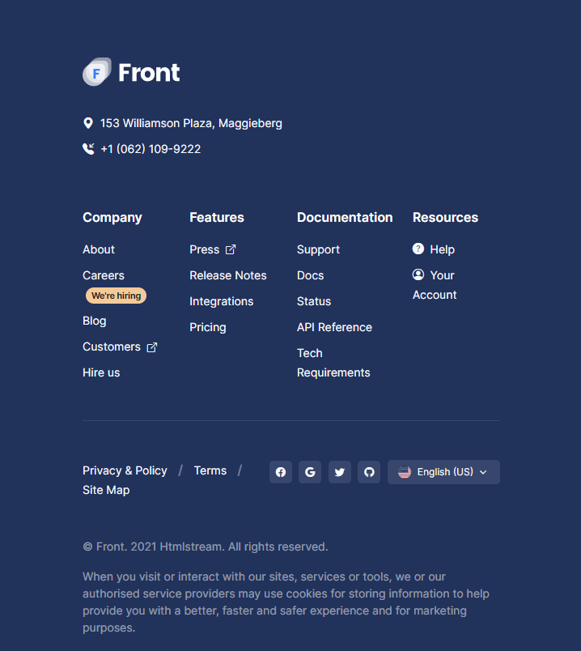
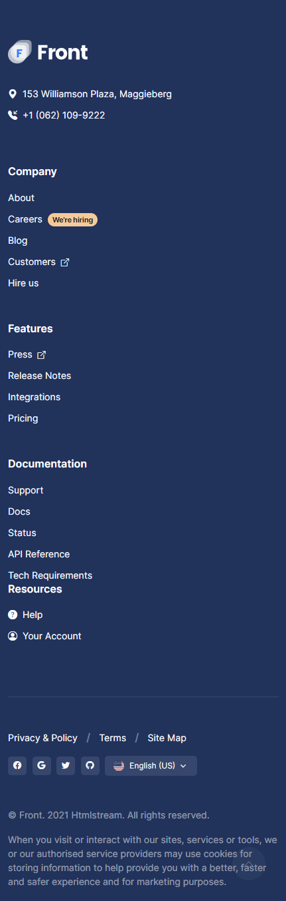

# Responsiveness Lab 2

## Overview
You've worked on a simple example in the previous lab. Now lets turn the difficulty up a notch :D

## Instructions
Just like the previous one, you're going to be working in pairs to finish this one too. The only difference here is that you will work on the whole thing in less time (45 mins)

Please make sure that you switch roles after you hit the 20 mins mark. (One of you needs to put a timer to remind you)

The duration of this lab is 45 mins.

## Todo
- Create the layout you see in this image
- Add responsiveness for screen sizes with widths less than **(1024px)**
- Add responsiveness for screen sizes with widths less than **(600px)**